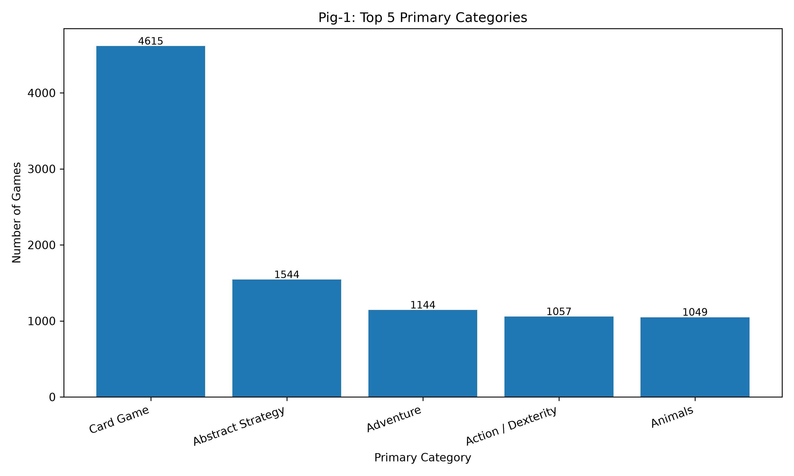
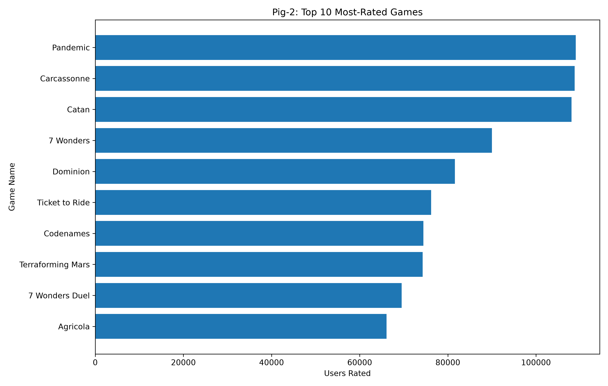
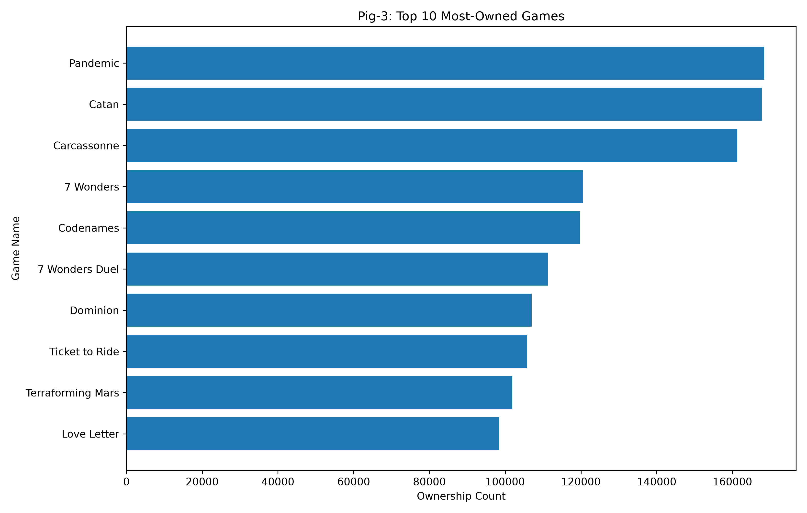
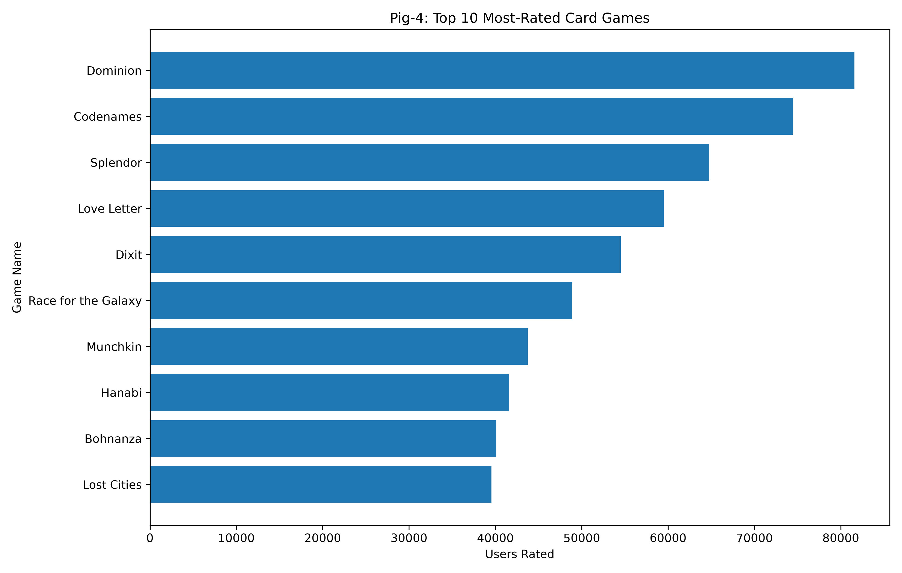
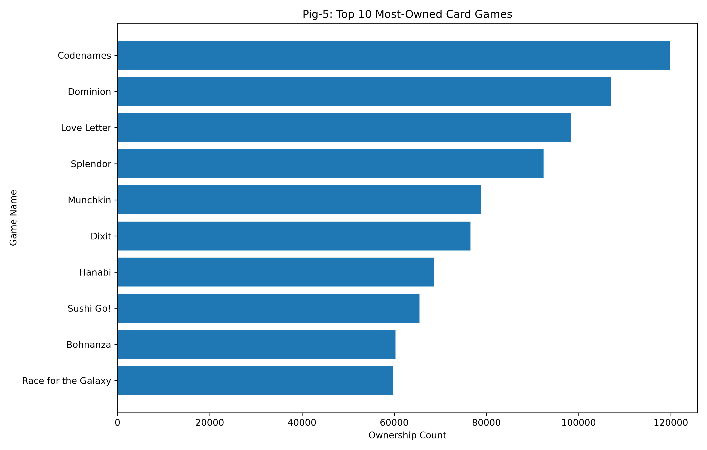

# BoardGameGeek Data Analysis using Hadoop

A Big Data Analytics Laboratory project that analyzes BoardGameGeek game data using **Apache Hadoop MapReduce** and **Apache Pig**.

The project contains:

- 3 Hadoop MapReduce analyses
- 5 Apache Pig analyses
- Dataset preprocessing using Python
- HDFS-based data processing
- Result files and execution screenshots
- Pig result visualizations
- A cleaned dataset sample
- Final laboratory report

---

## Project Objective

The objective of this project is to process and analyze a BoardGameGeek dataset using Hadoop and Apache Pig.

The analysis focuses on game ownership, user ratings, publishers, and primary categories.

As required for the project:

- **3 MapReduce programs** were implemented
- **5 Apache Pig analyses** were implemented
- **Hive was not used**

---

## Dataset

The project uses the **BoardGameGeek Reviews** dataset from Kaggle.

**Dataset source:**
[BoardGameGeek Reviews on Kaggle](https://www.kaggle.com/datasets/jvanelteren/boardgamegeek-reviews)

The file used for this project was:

```text
games_detailed_info.csv
```

### Raw Dataset

- Records: **21,631**
- Columns: **56**
- Duplicate game IDs: **0**
- Malformed CSV rows: **0**

### Cleaned Dataset

After preprocessing:

- Records: **21,347**
- Fields: **13**
- Primary categories: **81**
- Primary publishers: **3,824**

The category and publisher columns in the original dataset may contain multiple values. To preserve one record per game, the first listed category and first listed publisher were selected as `primaryCategory` and `primaryPublisher`.

The complete raw dataset is not stored in this repository. A small cleaned sample is available at:

```text
dataset/boardgames_sample.csv
```

More information is available in:

```text
dataset/README.md
```

---

## Cleaned Dataset Schema

| No. | Attribute | Description |
|---:|---|---|
| 1 | `gameID` | Unique game identifier |
| 2 | `name` | Game title |
| 3 | `yearPublished` | Publication year |
| 4 | `primaryPublisher` | First listed publisher |
| 5 | `primaryCategory` | First listed category |
| 6 | `minPlayers` | Minimum number of players |
| 7 | `maxPlayers` | Maximum number of players |
| 8 | `playingTime` | Playing time |
| 9 | `usersRated` | Number of users who rated |
| 10 | `averageRating` | Average rating |
| 11 | `owned` | Ownership count |
| 12 | `numComments` | Number of comments |
| 13 | `averageWeight` | Average complexity value |

---

## Dataset Preprocessing

The raw CSV file was cleaned using Python.

The preprocessing script:

```text
preprocessing/prepare_boardgames.py
```

Main preprocessing operations:

- Parsed the original CSV safely
- Extracted the first listed category as `primaryCategory`
- Extracted the first listed publisher as `primaryPublisher`
- Removed records with missing required values
- Cleaned embedded commas and line breaks
- Reduced the dataset from 56 columns to 13 required fields
- Preserved one output record per valid game
- Removed the CSV header before Hadoop processing

Final cleaned record count:

```text
21,347
```

---

## Experimental Environment

The project was executed using:

- **Apache Hadoop:** 3.4.1
- **Apache Pig:** 0.17.0
- **OpenJDK:** 11.0.32
- **Operating System:** macOS
- **Hadoop mode:** Pseudo-distributed

The Hadoop services used included:

- NameNode
- DataNode
- SecondaryNameNode
- ResourceManager
- NodeManager
- JobHistoryServer

The cleaned dataset was uploaded to HDFS at:

```text
/boardgame/boardgames.csv
```

---

# Hadoop MapReduce Analysis

## MR-1: Most Owned Board Game

### Objective

Find the board game with the highest `owned` value.

### Result

```text
30549    Pandemic    168364
```

**Pandemic** is the most-owned game in the cleaned dataset with **168,364 owners**.

### Source

```text
MapReduce/MR1_MostOwned/
```

### Result File

```text
results/mapreduce/mr1_most_owned.txt
```

---

## MR-2: Rating and Engagement Summary

### Objective

Generate one summary record for each game containing:

- Average rating
- Number of users who rated the game
- Number of comments

The output contains exactly:

```text
21,347 records
```

Example for Pandemic:

```text
30549    7.58896    109006    17305
```

### Source

```text
MapReduce/MR2_RatingEngagement/
```

### Result File

```text
results/mapreduce/mr2_rating_engagement.txt
```

---

## MR-3: Games per Publisher

### Objective

Count the number of games associated with each `primaryPublisher`.

The analysis produced:

```text
3,824 primary publishers
```

### Top 10 Publishers

| Publisher | Games |
|---|---:|
| (Self-Published) | 543 |
| (Web published) | 380 |
| Hasbro | 379 |
| Decision Games (I) | 272 |
| GMT Games | 268 |
| Ravensburger | 255 |
| AMIGO | 249 |
| (Public Domain) | 214 |
| KOSMOS | 212 |
| 999 Games | 208 |

### Source

```text
MapReduce/MR3_GamesPerPublisher/
```

### Result File

```text
results/mapreduce/mr3_games_per_publisher.txt
```

---

# Apache Pig Analysis

## Pig-1: Top 5 Primary Categories

Games were grouped by `primaryCategory`, counted, and ranked by the number of games.

### Result

| Category | Games |
|---|---:|
| Card Game | 4,615 |
| Abstract Strategy | 1,544 |
| Adventure | 1,144 |
| Action / Dexterity | 1,057 |
| Animals | 1,049 |

**Card Game** is the largest primary category with **4,615 games**.

### Result File

```text
results/pig/pig1_top5_categories.txt
```

### Visualization



---

## Pig-2: Top 10 Most-Rated Games

Games were sorted using `usersRated`.

Here, **most-rated** means the highest number of submitted user ratings, not the highest average rating.

### Top Result

```text
30549|Pandemic|Medical|109006
```

**Pandemic** has the highest number of user ratings with **109,006 ratings**.

### Result File

```text
results/pig/pig2_top10_most_rated.txt
```

### Visualization



---

## Pig-3: Top 10 Most-Owned Games

Games were sorted according to the `owned` field.

### Top Result

```text
30549|Pandemic|Medical|168364
```

**Pandemic** is the most-owned game with **168,364 owners**.

This result matches MR-1.

### Result File

```text
results/pig/pig3_top10_most_owned.txt
```

### Visualization



---

## Pig-4: Top 10 Most-Rated Games by Category

Games were grouped by `primaryCategory`. Within each category, games were sorted by `usersRated` and the top 10 were retained.

The cleaned dataset contains:

```text
81 primary categories
```

The analysis produced:

```text
800 output records
```

The result is lower than 810 because some categories contain fewer than 10 games.

### Card Game Example

```text
36218|Dominion|Card Game|81582
178900|Codenames|Card Game|74456
148228|Splendor|Card Game|64734
129622|Love Letter|Card Game|59484
39856|Dixit|Card Game|54525
28143|Race for the Galaxy|Card Game|48919
1927|Munchkin|Card Game|43759
98778|Hanabi|Card Game|41588
11|Bohnanza|Card Game|40113
50|Lost Cities|Card Game|39535
```

### Result File

```text
results/pig/pig4_top10_rated_by_category.txt
```

### Visualization

The chart below shows the Card Game category as a representative category-wise visualization.



---

## Pig-5: Top 10 Most-Owned Games by Category

Games were grouped by `primaryCategory`. Within each category, games were sorted by `owned` and the top 10 were retained.

The analysis produced:

```text
800 output records across 81 primary categories
```

### Card Game Example

```text
178900|Codenames|Card Game|119753
36218|Dominion|Card Game|106956
129622|Love Letter|Card Game|98395
148228|Splendor|Card Game|92366
1927|Munchkin|Card Game|78849
39856|Dixit|Card Game|76535
98778|Hanabi|Card Game|68643
133473|Sushi Go!|Card Game|65495
11|Bohnanza|Card Game|60282
28143|Race for the Galaxy|Card Game|59758
```

### Result File

```text
results/pig/pig5_top10_owned_by_category.txt
```

### Visualization

The chart below shows the Card Game category as a representative category-wise visualization.



---

## Pig Compatibility Note

Apache Pig 0.17.0 was executed in MapReduce mode with Hadoop 3.4.1.

During testing, a top-level `ORDER BY` operation caused a compatibility problem. The working Pig scripts therefore use nested `ORDER BY` operations inside grouped `FOREACH` blocks where required.

---

## Screenshots

Execution evidence is stored in the `screenshots/` directory.

| Screenshot | Description |
|---|---|
| `ss1_setup.png` | Hadoop environment, running services and HDFS files |
| `ss2_mr1.png` | MR-1 most-owned result and verification |
| `ss3_mr2.png` | MR-2 rating and engagement output |
| `ss4_mr3.png` | MR-3 publisher counts |
| `ss5_pig1.png` | Pig-1 top primary categories |
| `ss6_pig2.png` | Pig-2 top most-rated games |
| `ss7_pig3.png` | Pig-3 top most-owned games |
| `ss8_pig4.png` | Pig-4 category-wise most-rated analysis |
| `ss9_pig5.png` | Pig-5 category-wise most-owned analysis |

---

## Summary of Results

| Analysis | Final Result |
|---|---|
| MR-1: Most Owned Game | Pandemic — 168,364 owners |
| MR-2: Rating Summary | 21,347 output records |
| MR-3: Games per Publisher | (Self-Published) — 543 games; 3,824 publishers |
| Pig-1: Top 5 Categories | Card Game — 4,615 games |
| Pig-2: Top 10 Most-Rated | Pandemic — 109,006 users rated |
| Pig-3: Top 10 Most-Owned | Pandemic — 168,364 owners |
| Pig-4: Rated by Category | 800 output records across 81 categories |
| Pig-5: Owned by Category | 800 output records across 81 categories |

---

## Key Findings

- Pandemic is the most-owned game with **168,364 owners**.
- Pandemic has the largest number of user ratings with **109,006 ratings**.
- Card Game is the largest primary category with **4,615 games**.
- (Self-Published) is the largest primary publisher group with **543 games**.
- The cleaned dataset contains **21,347 games**.
- The cleaned dataset contains **81 primary categories** and **3,824 primary publishers**.

---

## Project Structure

```text
boardgame_lab/
├── MapReduce/
│   ├── MR1_MostOwned/
│   ├── MR2_RatingEngagement/
│   └── MR3_GamesPerPublisher/
├── PigAnalysis/
├── preprocessing/
│   └── prepare_boardgames.py
├── dataset/
│   ├── README.md
│   └── boardgames_sample.csv
├── results/
│   ├── mapreduce/
│   └── pig/
├── screenshots/
├── visualizations/
│   └── pig/
│       ├── pig1_top5_categories.png
│       ├── pig2_top10_most_rated.png
│       ├── pig3_top10_most_owned.png
│       ├── pig4_card_game_top10_rated.png
│       ├── pig5_card_game_top10_owned.png
│       └── visualize_pig_results.py
├── report/
│   └── BDAL_lab_report.pdf
├── README.md
└── .gitignore
```

---

## Final Report

The complete laboratory report is available here:

[View Final Lab Report](report/BDAL_lab_report.pdf)

---

## References

1. [BoardGameGeek Reviews Dataset - Kaggle](https://www.kaggle.com/datasets/jvanelteren/boardgamegeek-reviews)
2. [BoardGameGeek XML API2](https://boardgamegeek.com/wiki/page/BGG_XML_API2)
3. [Apache Hadoop 3.4.1 Documentation](https://hadoop.apache.org/docs/r3.4.1/)
4. [Apache Pig 0.17.0 Documentation](https://pig.apache.org/docs/r0.17.0/)

---

## Author

**Tahsin Ahmed Rafi**

Department of Computer Science and Engineering
Premier University, Chittagong

Course: **Big Data Analytics Laboratory (CSE 4346)**
